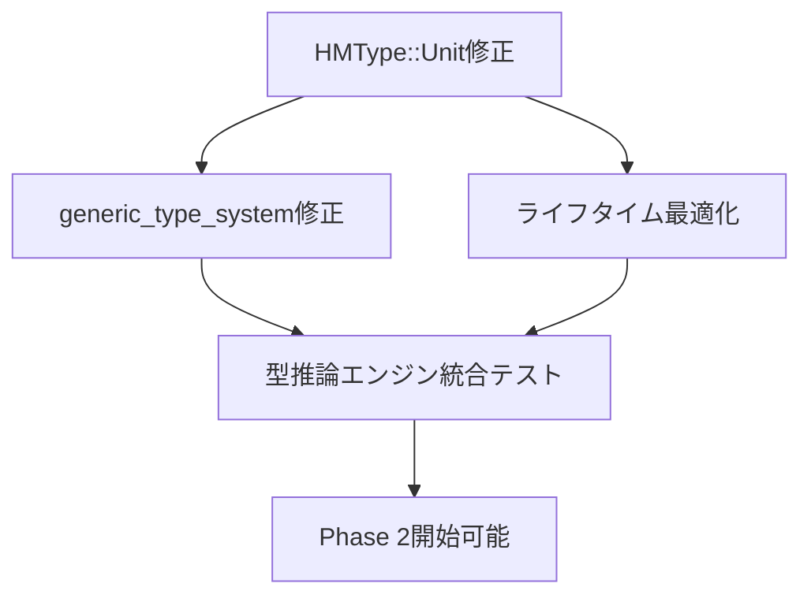
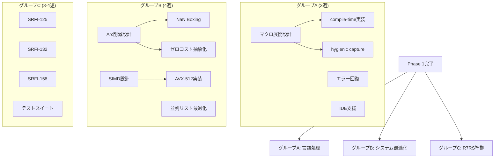
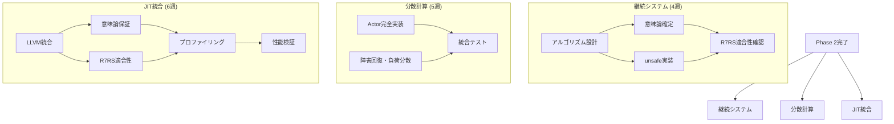

# 依存関係マトリクス・協業管理

**更新日**: 2025-08-20  
**管理目的**: タスク間依存関係の可視化・並列実行最大化・ブロック要因早期発見

---

## 🔗 Phase別依存関係マップ

### Phase 1: 型システム統一 (クリティカルパス)

**ブロック分析**:
- **P0クリティカル**: Phase 1全体 → 他全Phase
- **内部依存**: 線形依存関係 (並列化困難)
- **期間**: 3週間 (短縮困難)

### Phase 2: 並列実行可能タスク群

**並列実行性**:
- **高並列**: グループA, B, C間は完全独立
- **グループ内**: 一部タスクに軽度依存関係
- **期間**: 4週 (最長グループBに合わせる)

### Phase 3: 高協業統合フェーズ

**協業依存性**:
- **継続システム**: 全専門家協業必須 (順次実行)
- **分散計算**: 中並列可能 
- **JIT統合**: 全専門家協業必須 (一部並列)
- **期間**: 6週 (JIT統合が最長)

---

## 📊 タスク依存関係詳細表

### 🔴 Phase 1 依存関係

| タスク | 前提条件 | 影響先 | 並列可能性 | ブロックリスク |
|-------|----------|--------|-----------|-------------|
| HMType::Unit修正 | - | generic_type_system, ライフタイム | **なし** | **高** |
| generic_type_system修正 | HMType完了 | 統合テスト | **なし** | **高** |
| ライフタイム最適化 | HMType完了 | 統合テスト | generic_typeと**並列可** | **中** |
| 統合テスト | 上記全完了 | Phase 2開始 | **なし** | **高** |

### 🟢 Phase 2 依存関係 (高並列性)

#### グループA: 言語処理拡張
| タスク | 前提条件 | 影響先 | 並列可能性 | 協業要否 |
|-------|----------|--------|-----------|----------|
| マクロ展開設計 | Phase 1完了 | compile-time, hygienic | **なし** | language-processor主導 |
| compile-time実装 | マクロ設計完了 | - | **なし** | rust-expert実装 |
| hygienic capture | マクロ設計完了 | - | compile-timeと**並列可** | 協業実装 |
| エラー回復改善 | Phase 1完了 | - | **完全独立** | language-processor独立 |
| IDE支援強化 | Phase 1完了 | - | **完全独立** | rust-expert独立 |

#### グループB: システム最適化
| タスク | 前提条件 | 影響先 | 並列可能性 | 協業要否 |
|-------|----------|--------|-----------|----------|
| Arc削減設計 | Phase 1完了 | NaN Boxing, ゼロコスト | **なし** | cs-architect主導 |
| NaN Boxing実装 | Arc設計完了 | - | **なし** | rust-expert実装 |
| ゼロコスト抽象化 | Arc設計完了 | - | NaN Boxingと**並列可** | rust-expert実装 |
| SIMD設計 | Phase 1完了 | AVX-512実装 | **Arc設計と並列可** | cs-architect主導 |
| AVX-512実装 | SIMD設計完了 | 並列リスト | **なし** | rust-expert実装 |
| 並列リスト最適化 | AVX-512完了 | - | **なし** | 協業実装 |

#### グループC: R7RS準拠 (完全独立)
| タスク | 前提条件 | 影響先 | 並列可能性 | 協業要否 |
|-------|----------|--------|-----------|----------|
| SRFI-125実装 | Phase 1完了 | - | **完全独立** | r7rs-programmer独立 |
| SRFI-132実装 | Phase 1完了 | - | **完全独立** | r7rs-programmer独立 |
| SRFI-158実装 | Phase 1完了 | - | **完全独立** | r7rs-programmer独立 |
| テストスイート | Phase 1完了 | - | **完全独立** | r7rs-programmer独立 |

### 🔵 Phase 3 依存関係 (高協業)

#### 継続システム (順次協業)
| タスク | 前提条件 | 担当 | 影響先 | 並列可能性 |
|-------|----------|------|--------|-----------|
| アルゴリズム設計 | Phase 2完了 | cs-architect | 意味論, unsafe実装 | **なし** |
| 意味論確定 | アルゴリズム完了 | language-processor | R7RS確認 | **なし** |
| unsafe実装 | アルゴリズム完了 | rust-expert | R7RS確認 | **意味論と並列可** |
| R7RS適合性確認 | 意味論+実装完了 | r7rs-programmer | - | **なし** |

#### 分散計算 (中並列)
| タスク | 前提条件 | 担当 | 影響先 | 並列可能性 |
|-------|----------|------|--------|-----------|
| Actor完全実装 | Phase 2完了 | cs-architect + rust-expert | 統合テスト | **障害回復と並列可** |
| 障害回復・負荷分散 | Phase 2完了 | cs-architect | 統合テスト | **Actorと並列可** |
| 統合テスト | 上記完了 | rust-expert | - | **なし** |

#### JIT統合 (段階的協業)
| タスク | 前提条件 | 担当 | 影響先 | 並列可能性 |
|-------|----------|------|--------|-----------|
| LLVM統合 | Phase 2完了 | cs-architect + rust-expert | 意味論, 適合性 | **なし** |
| 意味論保証 | LLVM統合進行 | language-processor | プロファイリング | **適合性と並列可** |
| R7RS適合性 | LLVM統合進行 | r7rs-programmer | プロファイリング | **意味論と並列可** |
| プロファイリング | 意味論+適合性完了 | rust-expert | 性能検証 | **なし** |
| 性能検証 | プロファイリング完了 | 全員協業 | - | **なし** |

---

## ⚠️ リスク・ブロック要因分析

### 高リスク依存関係

#### 1. Phase 1 → 全Phase (最大ブロックリスク)
**リスク**: 型システム統一遅延 → プロジェクト全体遅延

**緩和策**:
- **早期プロトタイプ**: 第1週で基本動作確認
- **段階的実装**: 最小限動作→完全実装  
- **専門家集中**: 他作業停止してでもPhase 1優先
- **リソース投入**: 追加専門家相談可能体制

**エスカレーション**:
- 1週間遅延: 他専門家支援要請
- 2週間遅延: スケジュール全面見直し

#### 2. JIT統合における全専門家協業
**リスク**: 協業調整困難 → 機能実装不完全

**緩和策**:
- **詳細設計事前協議**: 実装前に完全仕様確定
- **段階的統合**: 小機能単位での反復統合
- **専門家ローテーション**: 各専門家の集中投入期間設定

#### 3. SIMD最適化の実装複雑性
**リスク**: プラットフォーム依存・性能未達

**緩和策**:
- **プラットフォーム限定実装**: 最初はx86-64のみ
- **フォールバック実装**: SIMD無効でも動作保証
- **段階的最適化**: 基本実装→SIMD最適化

### 中リスク依存関係

#### 1. 分散計算の複雑性
**リスク**: Actor実装とネットワーク統合の困難

**緩和策**:
- **単体テスト充実**: Actor単体→ネットワーク→統合
- **既存実装活用**: 実績ある並行ライブラリ使用

#### 2. R7RS適合性検証の網羅性
**リスク**: 細部仕様の見落とし→適合性問題

**緩和策**:
- **自動テスト充実**: R7RSテストスイート活用
- **段階的検証**: 機能実装毎の適合性確認

---

## 🚀 並列実行最大化戦略

### Phase 2 並列実行プラン (4専門家フル活用)

**週1-2: 設計フェーズ**
- language-processor: マクロ展開設計 + エラー回復設計
- cs-architect: Arc削減設計 + SIMD設計  
- rust-expert: 実装計画策定・技術調査
- r7rs-programmer: SRFI-125実装開始

**週3-4: 実装フェーズ**
- language-processor + rust-expert: マクロ関連協業実装
- cs-architect + rust-expert: メモリ最適化協業実装
- r7rs-programmer: SRFI-132, 158実装 (完全独立)

**期待効果**:
- **理論上最大効率**: 4専門家 × 4週 = 16人週
- **実際効率**: 協業オーバーヘッド考慮 → 約12人週効果
- **時間短縮**: 単独作業比 3-4倍高速

### Phase 3 協業最適化

**継続システム (順次協業最適化)**:
- 設計→実装→検証の効率的引き継ぎ
- 各専門家の集中投入期間を明確化
- ブロック時間最小化

**JIT統合 (複合協業最適化)**:
- LLVM統合: cs-architect + rust-expert集中協業
- 意味論・適合性: language-processor + r7rs-programmer並列作業
- 最終統合: 全員協業最小化

---

## 📅 依存関係追跡・管理システム

### 日次チェック項目

**各専門家報告必須**:
- [ ] 今日完了予定タスクの進捗率
- [ ] 依存しているタスクの完了待ち状況  
- [ ] 自分が依存先となっているタスクの進捗
- [ ] 明日の作業に影響する依存関係変更

### 週次依存関係レビュー

**毎週月曜 全体会議**:
1. **依存関係ステータス**: 全依存の完了・遅延状況確認
2. **ブロック要因特定**: 遅延が他に与える影響分析
3. **並列化機会発見**: 新たに並列実行可能となったタスク
4. **リスク評価更新**: 依存関係変更による新リスク

### 緊急時エスカレーション

**自動アラート条件**:
- Phase 1タスク遅延 >1日: 即時全員通知
- クリティカルパス遅延 >3日: スケジュール見直し会議
- 並列作業ブロック: 代替並列化策検討

**対応プロセス**:
1. **即時影響分析**: 遅延が与える全体影響評価
2. **リソース再配分**: 他タスクからのリソース移動  
3. **代替案検討**: 依存関係変更・仕様調整可能性
4. **スケジュール調整**: 必要に応じた期間・目標調整

---

## 🎯 成功指標・KPI

### 並列実行効率
- **目標**: Phase 2で理論値の75%以上効率達成
- **測定**: 実投入人時 vs 完了作業量
- **改善**: 週次効率分析・ボトルネック解消

### 依存関係管理
- **遅延伝播防止**: ブロック時間を全体の5%以下
- **早期発見**: リスク要因を1週間前に検出
- **迅速対応**: ブロック発生から24時間以内に対策実施

### 協業品質
- **コミュニケーション**: 依存関係の誤解・見落としゼロ
- **品質保証**: 協業成果物の手戻りを10%以下
- **知識共有**: 専門家間の技術知識効果的移転

---

*最終更新: 2025-08-20*  
*更新予定: 依存関係変更時・遅延発生時・週次レビュー後*