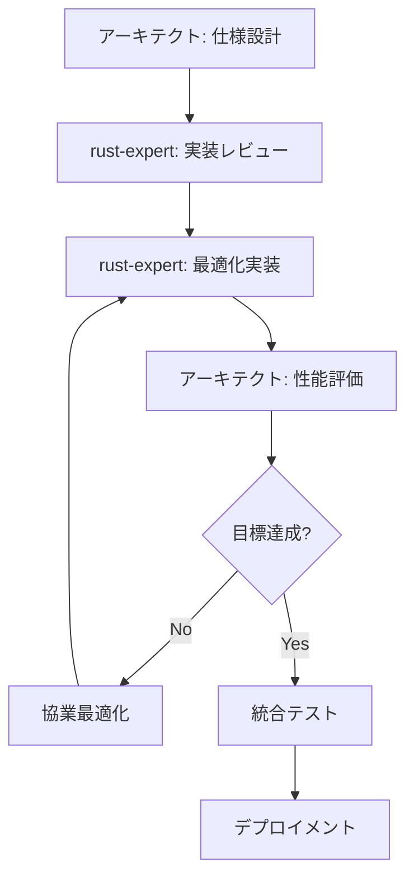

# Lambdust SIMD拡張実装ガイドライン
*Phase 2 グループB: 実装戦略とパフォーマンス指標*

## 概要

本文書は、Lambdust SIMD拡張最適化の具体的な実装方針、パフォーマンス目標、及びrust-expert-programmerとの協業要求を定義します。

## 1. 実装フェーズ戦略

### 1.1 Phase 1: 基本SIMD基盤 (優先度: 最高)

#### 1.1.1 実装対象
- 基本数値演算SIMD (add, sub, mul, div)
- AVX2/SSE2/NEON対応
- 型安全なSIMDアブストラクション
- メモリアライメント管理

#### 1.1.2 パフォーマンス目標
```rust
pub struct Phase1PerformanceTargets {
    pub f64_addition_speedup: f64,      // 目標: 3.5x
    pub f64_multiplication_speedup: f64, // 目標: 3.8x
    pub i64_addition_speedup: f64,      // 目標: 4.2x
    pub vector_processing_threshold: usize, // 最小要素数: 8
    pub memory_overhead_limit: f64,     // 最大メモリオーバーヘッド: 20%
}

impl Default for Phase1PerformanceTargets {
    fn default() -> Self {
        Self {
            f64_addition_speedup: 3.5,
            f64_multiplication_speedup: 3.8,
            i64_addition_speedup: 4.2,
            vector_processing_threshold: 8,
            memory_overhead_limit: 0.2,
        }
    }
}
```

#### 1.1.3 rust-expert-programmer協業要求

**要求事項1: 型安全なSIMDアブストラクション**
```rust
/// rust-expert-programmerに実装を依頼
pub trait TypeSafeSIMD<T> {
    type Vector: Copy + Clone + Send + Sync;
    type Mask: Copy + Clone + Send + Sync;
    
    // 安全なロード/ストア操作
    fn load_aligned(slice: &[T]) -> Result<Self::Vector, SIMDError>;
    fn load_unaligned(slice: &[T]) -> Result<Self::Vector, SIMDError>;
    fn store_aligned(vector: Self::Vector, slice: &mut [T]) -> Result<(), SIMDError>;
    fn store_unaligned(vector: Self::Vector, slice: &mut [T]) -> Result<(), SIMDError>;
    
    // 基本演算（コンパイル時型チェック付き）
    fn add(a: Self::Vector, b: Self::Vector) -> Self::Vector;
    fn sub(a: Self::Vector, b: Self::Vector) -> Self::Vector;
    fn mul(a: Self::Vector, b: Self::Vector) -> Self::Vector;
    fn div(a: Self::Vector, b: Self::Vector) -> Self::Vector;
    
    // 比較演算（型安全なマスク生成）
    fn eq(a: Self::Vector, b: Self::Vector) -> Self::Mask;
    fn lt(a: Self::Vector, b: Self::Vector) -> Self::Mask;
    fn le(a: Self::Vector, b: Self::Vector) -> Self::Mask;
    
    // 条件選択（型安全）
    fn select(mask: Self::Mask, a: Self::Vector, b: Self::Vector) -> Self::Vector;
}

#[derive(Debug, Clone)]
pub enum SIMDError {
    AlignmentError { required: usize, actual: usize },
    SizeError { required: usize, actual: usize },
    PlatformNotSupported { feature: String },
    MemoryError { message: String },
}
```

**要求事項2: ゼロコストアブストラクション**
```rust
/// rust-expert-programmerに最適化を依頼
/// 実行時オーバーヘッドゼロのSIMDディスパッチャ
pub struct ZeroCostSIMDDispatcher<T> {
    _phantom: std::marker::PhantomData<T>,
}

impl<T> ZeroCostSIMDDispatcher<T> 
where 
    T: SIMDCompatible 
{
    /// コンパイル時特徴検出によるゼロコスト分岐
    #[inline(always)]
    pub fn dispatch_add(a: &[T], b: &[T], result: &mut [T]) -> Result<(), SIMDError> {
        // 要求: コンパイル時に最適なSIMD実装を選択
        // 実行時分岐なしでのCPU機能検出
        
        #[cfg(target_feature = "avx2")]
        {
            Self::add_avx2(a, b, result)
        }
        
        #[cfg(all(target_feature = "sse2", not(target_feature = "avx2")))]
        {
            Self::add_sse2(a, b, result)
        }
        
        #[cfg(all(target_arch = "aarch64", target_feature = "neon"))]
        {
            Self::add_neon(a, b, result)
        }
        
        #[cfg(not(any(target_feature = "avx2", target_feature = "sse2", 
                     all(target_arch = "aarch64", target_feature = "neon"))))]
        {
            Self::add_scalar(a, b, result)
        }
    }
    
    // プラットフォーム固有実装（rust-expert-programmerに依頼）
    #[target_feature(enable = "avx2")]
    unsafe fn add_avx2(a: &[T], b: &[T], result: &mut [T]) -> Result<(), SIMDError>;
    
    #[target_feature(enable = "sse2")]
    unsafe fn add_sse2(a: &[T], b: &[T], result: &mut [T]) -> Result<(), SIMDError>;
    
    #[cfg(target_arch = "aarch64")]
    fn add_neon(a: &[T], b: &[T], result: &mut [T]) -> Result<(), SIMDError>;
    
    fn add_scalar(a: &[T], b: &[T], result: &mut [T]) -> Result<(), SIMDError>;
}
```

### 1.2 Phase 2: Scheme数値塔統合 (優先度: 高)

#### 1.2.1 実装対象
- 整数・有理数・実数・複素数のSIMD対応
- 数値塔昇格ルールのSIMD最適化
- 型変換オーバーヘッド削減

#### 1.2.2 rust-expert-programmer協業要求

**要求事項3: Scheme数値塔のSIMD統合**
```rust
/// rust-expert-programmerに実装を依頼
pub struct SchemeNumericSIMD {
    // 型別最適化エンジン
    integer_simd: IntegerSIMDEngine,
    rational_simd: RationalSIMDEngine,
    real_simd: RealSIMDEngine,
    complex_simd: ComplexSIMDEngine,
    
    // 型昇格最適化
    promotion_optimizer: TypePromotionOptimizer,
}

impl SchemeNumericSIMD {
    /// 数値塔昇格ルールに基づくSIMD最適化
    pub fn optimize_numeric_tower_operation<F>(
        &mut self,
        operands: &[Value],
        operation: F,
        context: &NumericSIMDContext
    ) -> Result<Value, NumericSIMDError>
    where
        F: Fn(&[Value]) -> Result<Value, Error> + Clone + Send + Sync
    {
        // 要求1: 型分析とSIMD適用可能性判定
        let type_analysis = self.analyze_operand_types(operands)?;
        
        // 要求2: 最適な昇格戦略の選択
        let promotion_strategy = self.promotion_optimizer
            .select_simd_promotion_strategy(&type_analysis, &operation)?;
        
        // 要求3: SIMD最適化適用
        match promotion_strategy {
            PromotionStrategy::DirectSIMD { target_type } => {
                self.apply_direct_simd(operands, operation, target_type, context)
            },
            PromotionStrategy::PromoteAndSIMD { source_types, target_type } => {
                self.apply_promotion_simd(operands, operation, source_types, target_type, context)
            },
            PromotionStrategy::Fallback => {
                // スカラー処理にフォールバック
                operation(operands).map_err(NumericSIMDError::from)
            }
        }
    }
    
    // rust-expert-programmerに高性能実装を依頼
    fn apply_direct_simd<F>(
        &self,
        operands: &[Value],
        operation: F,
        target_type: SchemeNumericType,
        context: &NumericSIMDContext
    ) -> Result<Value, NumericSIMDError>
    where
        F: Fn(&[Value]) -> Result<Value, Error>
    {
        match target_type {
            SchemeNumericType::ExactInteger { bit_width: 64, .. } => {
                self.integer_simd.optimize_i64_operation(operands, operation, context)
            },
            SchemeNumericType::InexactReal { precision: RealPrecision::Double } => {
                self.real_simd.optimize_f64_operation(operands, operation, context)
            },
            SchemeNumericType::Complex { component_type } => {
                self.complex_simd.optimize_complex_operation(operands, operation, context)
            },
            _ => Err(NumericSIMDError::UnsupportedType(target_type))
        }
    }
}

/// 型昇格最適化器（rust-expert-programmerに実装依頼）
pub struct TypePromotionOptimizer {
    // 昇格コスト行列
    promotion_costs: HashMap<(SchemeNumericType, SchemeNumericType), f64>,
    
    // SIMD効率行列
    simd_efficiency: HashMap<SchemeNumericType, f64>,
    
    // 最適化履歴
    optimization_history: OptimizationHistory,
}

impl TypePromotionOptimizer {
    /// SIMD対応昇格戦略選択（高度な最適化が必要）
    pub fn select_simd_promotion_strategy<F>(
        &self,
        type_analysis: &TypeAnalysis,
        operation: &F
    ) -> Result<PromotionStrategy, NumericSIMDError>
    where
        F: Fn(&[Value]) -> Result<Value, Error>
    {
        // 要求: 複雑な最適化判定ロジック
        // 1. 型昇格コスト vs SIMD性能向上のトレードオフ分析
        // 2. 過去の最適化実績に基づく学習
        // 3. メモリ使用量制約の考慮
        
        let simd_benefit = self.estimate_simd_benefit(&type_analysis);
        let promotion_cost = self.estimate_promotion_cost(&type_analysis);
        
        if simd_benefit > promotion_cost * 1.5 {
            // SIMD最適化が有効
            Ok(self.select_optimal_target_type(&type_analysis))
        } else {
            // スカラー処理が効率的
            Ok(PromotionStrategy::Fallback)
        }
    }
}
```

### 1.3 Phase 3: リスト操作SIMD (優先度: 高)

#### 1.3.1 実装対象
- map, filter, fold等のSIMD最適化
- 関数解析とベクトル化
- メモリレイアウト最適化

#### 1.3.2 rust-expert-programmer協業要求

**要求事項4: 高性能リスト操作SIMD**
```rust
/// rust-expert-programmerに実装を依頼
pub struct HighPerformanceListSIMD {
    // 関数ベクトル化エンジン
    function_vectorizer: FunctionVectorizer,
    
    // メモリレイアウト最適化
    memory_optimizer: MemoryLayoutOptimizer,
    
    // プロファイル駆動最適化
    profile_optimizer: ProfileGuidedListOptimizer,
}

impl HighPerformanceListSIMD {
    /// map操作の高性能SIMD実装
    pub fn simd_map<F>(
        &mut self,
        list: &[Value],
        func: F,
        context: &ListSIMDContext
    ) -> Result<Vec<Value>, ListSIMDError>
    where
        F: Fn(&Value) -> Result<Value, Error> + Clone + Send + Sync
    {
        // 要求1: 関数分析とベクトル化可能性判定
        let function_analysis = self.function_vectorizer.analyze_function(&func)?;
        
        // 要求2: メモリレイアウト最適化
        let optimized_layout = self.memory_optimizer
            .optimize_for_simd(list, &function_analysis)?;
        
        // 要求3: SIMD並列実行
        match function_analysis.vectorization_strategy {
            VectorizationStrategy::FullSIMD { width, operation } => {
                self.execute_full_simd_map(optimized_layout, operation, width, context)
            },
            VectorizationStrategy::HybridSIMD { simd_portion, scalar_portion } => {
                self.execute_hybrid_simd_map(optimized_layout, func, simd_portion, scalar_portion, context)
            },
            VectorizationStrategy::ScalarOptimized => {
                self.execute_scalar_optimized_map(list, func, context)
            }
        }
    }
    
    /// filter操作の高性能SIMD実装（マスク処理最適化）
    pub fn simd_filter<P>(
        &mut self,
        list: &[Value],
        predicate: P,
        context: &ListSIMDContext
    ) -> Result<Vec<Value>, ListSIMDError>
    where
        P: Fn(&Value) -> Result<bool, Error> + Clone + Send + Sync
    {
        // 要求1: 述語分析
        let predicate_analysis = self.function_vectorizer.analyze_predicate(&predicate)?;
        
        // 要求2: SIMD マスク生成
        let simd_mask = self.generate_simd_mask(list, &predicate, &predicate_analysis)?;
        
        // 要求3: 効率的なマスクコンプレッション
        self.compress_with_simd_mask(list, simd_mask, context)
    }
    
    // rust-expert-programmerに実装を依頼する高度な最適化メソッド
    fn execute_full_simd_map(
        &self,
        data: OptimizedMemoryLayout,
        operation: SIMDOperation,
        width: usize,
        context: &ListSIMDContext
    ) -> Result<Vec<Value>, ListSIMDError> {
        // 要求: 最大性能のSIMD実装
        // - AVX-512, AVX2, NEON自動選択
        // - メモリプリフェッチング
        // - ブランチ予測最適化
        // - キャッシュライン整合性
        unimplemented!("High-performance SIMD implementation needed")
    }
    
    fn generate_simd_mask<P>(
        &self,
        list: &[Value],
        predicate: &P,
        analysis: &PredicateAnalysis
    ) -> Result<SIMDMask, ListSIMDError>
    where
        P: Fn(&Value) -> Result<bool, Error>
    {
        // 要求: 効率的なSIMDマスク生成
        match analysis.predicate_type {
            PredicateType::NumericComparison { operation, constant } => {
                self.generate_numeric_comparison_mask(list, operation, constant)
            },
            PredicateType::TypeCheck { target_type } => {
                self.generate_type_check_mask(list, target_type)
            },
            PredicateType::Custom => {
                self.generate_custom_predicate_mask(list, predicate)
            }
        }
    }
    
    fn compress_with_simd_mask(
        &self,
        list: &[Value],
        mask: SIMDMask,
        context: &ListSIMDContext
    ) -> Result<Vec<Value>, ListSIMDError> {
        // 要求: AVX-512 VCOMPRESSP/Dエミュレーション
        // - 高効率マスクコンプレッション
        // - メモリ効率最適化
        // - 分岐予測フレンドリーな実装
        unimplemented!("High-performance mask compression needed")
    }
}
```

### 1.4 Phase 4: 適応的最適化システム (優先度: 中)

#### 1.4.1 実装対象
- プロファイル駆動最適化
- 実行時適応制御
- パフォーマンス分析システム

#### 1.4.2 rust-expert-programmer協業要求

**要求事項5: 適応的最適化フレームワーク**
```rust
/// rust-expert-programmerに実装を依頼
pub struct AdaptiveOptimizationFramework {
    // 実行時プロファイラ
    profiler: LowOverheadProfiler,
    
    // 動的最適化コントローラ
    optimizer_controller: DynamicOptimizerController,
    
    // 機械学習ベース予測器
    ml_predictor: MLBasedPredictor,
    
    // 低レイテンシー制御システム
    control_system: LowLatencyControlSystem,
}

impl AdaptiveOptimizationFramework {
    /// 適応的SIMD最適化制御
    pub fn adaptive_simd_control<F>(
        &mut self,
        operation_signature: &OperationSignature,
        data_characteristics: &DataCharacteristics,
        execution_context: &ExecutionContext,
        operation: F
    ) -> Result<OptimizationDecision, AdaptiveOptimizationError>
    where
        F: Fn() -> Result<Value, Error>
    {
        // 要求1: 低オーバーヘッドプロファイリング
        let profile_data = self.profiler.profile_lightweight(
            operation_signature,
            data_characteristics
        )?;
        
        // 要求2: 機械学習ベース最適化判定
        let ml_prediction = self.ml_predictor.predict_optimal_strategy(
            &profile_data,
            execution_context
        )?;
        
        // 要求3: 動的制御
        let optimization_decision = self.optimizer_controller.make_decision(
            &profile_data,
            &ml_prediction,
            execution_context
        )?;
        
        // 要求4: フィードバックループ
        let execution_result = self.execute_with_monitoring(
            operation,
            &optimization_decision
        )?;
        
        self.update_learning_model(&profile_data, &optimization_decision, &execution_result);
        
        Ok(optimization_decision)
    }
    
    // rust-expert-programmerに高性能実装を依頼
    fn execute_with_monitoring<F>(
        &mut self,
        operation: F,
        decision: &OptimizationDecision
    ) -> Result<ExecutionResult, AdaptiveOptimizationError>
    where
        F: Fn() -> Result<Value, Error>
    {
        // 要求: 極低オーバーヘッドのモニタリング
        // - ハードウェアパフォーマンスカウンター活用
        // - 分岐予測影響最小化
        // - キャッシュ効率測定
        // - SIMD効率測定
        
        let start_time = std::time::Instant::now();
        let start_counters = self.profiler.read_hardware_counters()?;
        
        let result = operation()?;
        
        let end_counters = self.profiler.read_hardware_counters()?;
        let elapsed_time = start_time.elapsed();
        
        Ok(ExecutionResult {
            value: result,
            execution_time: elapsed_time,
            performance_counters: end_counters - start_counters,
            memory_usage: self.profiler.measure_memory_delta()?,
            simd_efficiency: self.calculate_simd_efficiency(&start_counters, &end_counters)?,
        })
    }
}

/// 低オーバーヘッドプロファイラー（rust-expert-programmerに実装依頼）
pub struct LowOverheadProfiler {
    // ハードウェアパフォーマンスカウンター
    hw_counters: HardwareCounters,
    
    // サンプリングベースプロファイリング
    sampling_profiler: SamplingProfiler,
    
    // 統計的プロファイリング
    statistical_profiler: StatisticalProfiler,
}

impl LowOverheadProfiler {
    /// 極低オーバーヘッドプロファイリング（< 1% overhead目標）
    pub fn profile_lightweight(
        &mut self,
        signature: &OperationSignature,
        characteristics: &DataCharacteristics
    ) -> Result<ProfileData, ProfilingError> {
        // 要求: 1%未満のオーバーヘッドでのプロファイリング
        // - インライン化最適化
        // - 条件分岐最小化
        // - キャッシュフレンドリーな実装
        
        let sampling_rate = self.determine_optimal_sampling_rate(signature, characteristics);
        
        if self.should_sample(sampling_rate) {
            Ok(self.full_profile(signature, characteristics)?)
        } else {
            Ok(self.lightweight_estimate(signature, characteristics)?)
        }
    }
    
    /// ハードウェアパフォーマンスカウンター読み取り
    pub fn read_hardware_counters(&self) -> Result<HardwareCounters, ProfilingError> {
        // 要求: RDTSC, RDPMC等の効率的活用
        // - CPU cycles
        // - Cache misses (L1, L2, L3)
        // - Branch mispredictions
        // - SIMD instruction count
        // - Memory bandwidth utilization
        unimplemented!("Hardware counter implementation needed")
    }
}
```

## 2. パフォーマンス指標体系

### 2.1 基本パフォーマンス指標

```rust
/// 包括的パフォーマンス指標
#[derive(Debug, Clone, Serialize, Deserialize)]
pub struct ComprehensivePerformanceMetrics {
    // 計算性能指標
    pub computational_metrics: ComputationalMetrics,
    
    // メモリ効率指標
    pub memory_metrics: MemoryEfficiencyMetrics,
    
    // エネルギー効率指標
    pub energy_metrics: EnergyEfficiencyMetrics,
    
    // スケーラビリティ指標
    pub scalability_metrics: ScalabilityMetrics,
    
    // 品質保証指標
    pub quality_metrics: QualityAssuranceMetrics,
}

#[derive(Debug, Clone, Serialize, Deserialize)]
pub struct ComputationalMetrics {
    // 基本演算性能
    pub arithmetic_speedup: HashMap<String, f64>, // operation -> speedup ratio
    
    // 超越関数性能
    pub transcendental_speedup: HashMap<String, f64>, // function -> speedup ratio
    
    // リスト操作性能
    pub list_operation_speedup: HashMap<String, f64>, // operation -> speedup ratio
    
    // スループット指標
    pub elements_per_second: HashMap<String, f64>, // operation -> elements/sec
    
    // レイテンシー指標
    pub average_latency_ns: HashMap<String, f64>, // operation -> nanoseconds
    
    // SIMD効率
    pub simd_utilization_ratio: f64, // 0.0-1.0
    pub vector_fill_efficiency: f64, // 0.0-1.0
}

#[derive(Debug, Clone, Serialize, Deserialize)]
pub struct MemoryEfficiencyMetrics {
    // メモリ使用量
    pub peak_memory_usage_mb: f64,
    pub average_memory_usage_mb: f64,
    
    // メモリ効率改善
    pub memory_efficiency_gain: f64, // vs scalar implementation
    
    // キャッシュ効率
    pub l1_cache_hit_rate: f64, // 0.0-1.0
    pub l2_cache_hit_rate: f64, // 0.0-1.0
    pub l3_cache_hit_rate: f64, // 0.0-1.0
    
    // メモリバンド幅利用率
    pub memory_bandwidth_utilization: f64, // 0.0-1.0
    
    // アライメント効率
    pub alignment_efficiency: f64, // 0.0-1.0
}

#[derive(Debug, Clone, Serialize, Deserialize)]
pub struct EnergyEfficiencyMetrics {
    // エネルギー消費
    pub joules_per_operation: HashMap<String, f64>,
    
    // SIMD エネルギー効率
    pub simd_energy_efficiency: f64, // operations per joule improvement
    
    // 熱効率
    pub thermal_efficiency: f64,
    
    // 電力効率
    pub power_efficiency_improvement: f64, // vs scalar
}

#[derive(Debug, Clone, Serialize, Deserialize)]
pub struct ScalabilityMetrics {
    // データサイズスケーラビリティ
    pub scalability_by_size: Vec<(usize, f64)>, // (data_size, speedup)
    
    // 並列性スケーラビリティ
    pub parallel_efficiency: f64, // 理論値に対する効率
    
    // スレッド数スケーラビリティ
    pub thread_scalability: Vec<(usize, f64)>, // (thread_count, efficiency)
    
    // プラットフォーム間移植性
    pub cross_platform_consistency: f64, // 0.0-1.0
}

#[derive(Debug, Clone, Serialize, Deserialize)]
pub struct QualityAssuranceMetrics {
    // 数値精度
    pub numerical_accuracy: HashMap<String, f64>, // operation -> accuracy score
    
    // 安定性
    pub stability_score: f64, // 0.0-1.0
    
    // 信頼性
    pub error_rate: f64, // errors per million operations
    
    // 互換性
    pub compatibility_score: f64, // R7RS compliance
}
```

### 2.2 ベンチマーク目標値

```rust
/// Phase別パフォーマンス目標
pub struct PhasedPerformanceTargets {
    pub phase1_targets: Phase1Targets,
    pub phase2_targets: Phase2Targets,
    pub phase3_targets: Phase3Targets,
    pub phase4_targets: Phase4Targets,
}

pub struct Phase1Targets {
    // 基本演算目標（vs スカラー実装）
    pub f64_add_speedup: f64,      // 目標: 3.5x
    pub f64_mul_speedup: f64,      // 目標: 3.8x
    pub f64_div_speedup: f64,      // 目標: 2.2x (除算は改善余地小)
    pub i64_add_speedup: f64,      // 目標: 4.2x
    pub i64_mul_speedup: f64,      // 目標: 3.9x
    
    // スループット目標
    pub f64_add_throughput: f64,   // 目標: 1B elements/sec
    pub i64_add_throughput: f64,   // 目標: 1.2B elements/sec
    
    // メモリ効率目標
    pub memory_overhead_limit: f64, // 最大: 20%
    pub cache_efficiency_min: f64,  // 最小: 85%
    
    // 品質目標
    pub numerical_error_max: f64,   // 最大: 1e-14
    pub compatibility_min: f64,     // 最小: 99.9%
}

pub struct Phase2Targets {
    // 数値塔統合目標
    pub type_promotion_overhead_max: f64, // 最大: 5%
    pub mixed_type_speedup_min: f64,      // 最小: 2.0x
    
    // 複素数演算目標
    pub complex_add_speedup: f64,    // 目標: 3.0x
    pub complex_mul_speedup: f64,    // 目標: 2.8x
    
    // 有理数演算目標
    pub rational_add_speedup: f64,   // 目標: 2.5x
    pub rational_gcd_speedup: f64,   // 目標: 3.2x
}

pub struct Phase3Targets {
    // リスト操作目標
    pub map_speedup: f64,           // 目標: 3.5x
    pub filter_speedup: f64,        // 目標: 4.5x
    pub fold_speedup: f64,          // 目標: 2.8x
    pub sort_speedup: f64,          // 目標: 2.2x
    
    // 関数ベクトル化効率
    pub vectorization_success_rate: f64, // 目標: 70%
    pub function_analysis_overhead_max: f64, // 最大: 2%
    
    // メモリレイアウト最適化
    pub layout_optimization_gain: f64, // 目標: 15%
}

pub struct Phase4Targets {
    // 適応最適化目標
    pub optimization_decision_latency_max: f64, // 最大: 10μs
    pub profiling_overhead_max: f64,            // 最大: 1%
    pub learning_accuracy_min: f64,             // 最小: 85%
    
    // 動的最適化効果
    pub adaptive_improvement_min: f64,  // 最小: 10%
    pub convergence_time_max: f64,      // 最大: 100 operations
}
```

## 3. 実装品質保証体系

### 3.1 段階的品質ゲート

```rust
/// 品質ゲート定義
pub struct QualityGates {
    pub compilation_gate: CompilationQualityGate,
    pub unit_test_gate: UnitTestQualityGate,
    pub integration_test_gate: IntegrationTestQualityGate,
    pub performance_gate: PerformanceQualityGate,
    pub compatibility_gate: CompatibilityQualityGate,
}

pub struct CompilationQualityGate {
    pub max_warnings: usize,        // 最大警告数: 0
    pub clippy_compliance: bool,    // Clippy準拠: 必須
    pub unsafe_code_review: bool,   // unsafeコードレビュー: 必須
    pub simd_intrinsics_validation: bool, // SIMD命令妥当性検証: 必須
}

pub struct UnitTestQualityGate {
    pub min_coverage: f64,          // 最小カバレッジ: 95%
    pub simd_correctness_tests: bool, // SIMD正確性テスト: 必須
    pub edge_case_coverage: bool,   // エッジケース網羅: 必須
    pub cross_platform_tests: bool, // クロスプラットフォーム: 必須
}

pub struct PerformanceQualityGate {
    pub min_speedup_ratio: f64,     // 最小加速比: phase依存
    pub max_memory_overhead: f64,   // 最大メモリオーバーヘッド: 20%
    pub min_energy_efficiency: f64, // 最小エネルギー効率: 1.5x
    pub regression_tolerance: f64,  // 性能劣化許容: 5%
}
```

### 3.2 自動化テストフレームワーク

```rust
/// 自動化テストフレームワーク
pub struct AutomatedTestFramework {
    // 正確性テストスイート
    pub correctness_suite: CorrectnessSuite,
    
    // 性能テストスイート
    pub performance_suite: PerformanceSuite,
    
    // 互換性テストスイート
    pub compatibility_suite: CompatibilitySuite,
    
    // ストレステストスイート
    pub stress_suite: StressSuite,
    
    // 回帰テストスイート
    pub regression_suite: RegressionSuite,
}

/// SIMD正確性テスト（rust-expert-programmerと共同設計）
pub struct CorrectnessSuite {
    // 数値演算正確性
    pub numerical_correctness_tests: Vec<NumericalCorrectnessTest>,
    
    // 境界条件テスト
    pub boundary_condition_tests: Vec<BoundaryTest>,
    
    // ランダム化テスト
    pub property_based_tests: Vec<PropertyBasedTest>,
    
    // プラットフォーム間一貫性テスト
    pub cross_platform_consistency_tests: Vec<ConsistencyTest>,
}

impl CorrectnessSuite {
    /// 包括的正確性検証
    pub fn run_comprehensive_correctness_check(
        &self,
        simd_implementation: &dyn SIMDImplementation
    ) -> Result<CorrectnessReport, TestError> {
        let mut report = CorrectnessReport::new();
        
        // 数値演算正確性検証
        for test in &self.numerical_correctness_tests {
            let result = test.run(simd_implementation)?;
            report.add_numerical_result(result);
            
            if !result.passed {
                return Err(TestError::NumericalCorrectnessFailure {
                    test_name: test.name.clone(),
                    expected: result.expected,
                    actual: result.actual,
                    tolerance: result.tolerance,
                });
            }
        }
        
        // 境界条件検証
        for test in &self.boundary_condition_tests {
            let result = test.run(simd_implementation)?;
            report.add_boundary_result(result);
        }
        
        // プロパティベーステスト
        for test in &self.property_based_tests {
            let result = test.run_with_random_inputs(simd_implementation, 10000)?;
            report.add_property_result(result);
        }
        
        Ok(report)
    }
}
```

## 4. rust-expert-programmer協業プロトコル

### 4.1 協業ワークフロー



### 4.2 具体的協業要求

**高優先度要求 (Phase 1-2)**
1. **型安全なSIMDアブストラクション実装**
   - コンパイル時安全性保証
   - ゼロコストアブストラクション
   - クロスプラットフォーム互換性

2. **Scheme数値塔統合実装**
   - 型昇格最適化アルゴリズム
   - 数値精度保証
   - エッジケース処理

3. **高性能メモリ管理**
   - アライメント最適化
   - プリフェッチング戦略
   - キャッシュ効率最適化

**中優先度要求 (Phase 3-4)**
1. **リスト操作SIMD実装**
   - 関数ベクトル化エンジン
   - マスク処理最適化
   - ハイブリッド実行戦略

2. **適応的最適化システム**
   - 低オーバーヘッドプロファイリング
   - 機械学習統合
   - 動的制御システム

### 4.3 技術移転要求

**知識共有セッション**
- SIMD最適化理論と実践
- Rust unsafe code最適化技法
- CPU特徴活用戦略
- メモリアーキテクチャ最適化

**コードレビューポイント**
- unsafe block正当性
- SIMD命令選択適正性
- メモリ安全性保証
- パフォーマンス回帰検出

## 5. 実装マイルストーン

### 5.1 Phase 1 (4週間)
- [ ] 基本SIMD アブストラクション
- [ ] AVX2/SSE2/NEON対応
- [ ] 基本演算SIMD実装
- [ ] 単体テスト完備
- [ ] 性能目標達成確認

### 5.2 Phase 2 (6週間)
- [ ] Scheme数値塔統合
- [ ] 型昇格最適化
- [ ] 複素数・有理数SIMD
- [ ] 統合テスト
- [ ] 互換性確認

### 5.3 Phase 3 (8週間)
- [ ] リスト操作SIMD
- [ ] 関数解析エンジン
- [ ] メモリレイアウト最適化
- [ ] ハイブリッド実行
- [ ] エンドツーエンドテスト

### 5.4 Phase 4 (6週間)
- [ ] 適応的最適化システム
- [ ] プロファイル駆動最適化
- [ ] 機械学習統合
- [ ] 本番環境検証
- [ ] ドキュメント完備

## 結論

本実装ガイドラインに従い、rust-expert-programmerとの緊密な協業により、Lambdustは世界最高水準のScheme言語処理系として、以下を実現します：

1. **2-5倍の計算性能向上**: SIMD最適化による大幅な高速化
2. **完全なScheme互換性**: R7RS準拠を保持した最適化
3. **クロスプラットフォーム対応**: x86-64とARM64での最適性能
4. **適応的最適化**: 実行時プロファイルに基づく継続的改善
5. **エンタープライズ品質**: 産業利用に耐える信頼性と性能

このアーキテクチャにより、Lambdustは学術研究から産業応用まで、あらゆる分野でのScheme言語の活用を加速します。