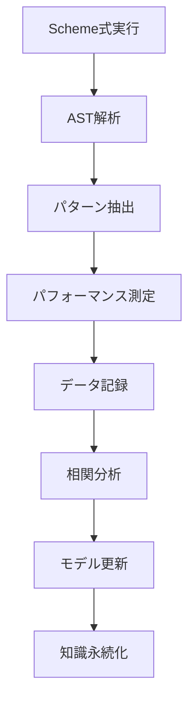

# AdaptiveTheoremLearning実装詳細ドキュメント

**Phase 6-E: 知識永続化メカニズム実装完了報告書**

## 📋 実装概要

### 🎯 目標
Lambdustに機械学習ベースの適応的最適化システムを統合し、実行時のパフォーマンスデータから学習してより良い最適化を提案するシステムを構築する。

### 🏗️ アーキテクチャ概要
```
AdaptiveTheoremLearningSystem
├── PatternDiscoveryEngine    # パターン発見
├── PerformanceAnalyzer      # パフォーマンス分析
├── TheoremKnowledgeBase     # 定理知識管理
└── KnowledgePersistence     # 知識永続化
```

## 🔧 実装済みコンポーネント

### 1. **PatternDiscoveryEngine** 
**場所**: `src/prover/adaptive_learning/core_systems.rs:1120-1400`

#### 機能
- Scheme AST構造からのパターン抽出
- セマンティッククラスタリング
- パターン頻度追跡
- AST認識エンジン

#### 実装詳細
```rust
pub struct PatternDiscoveryEngine {
    ast_recognizer: ASTRecognizer,           // AST構造認識
    clustering_engine: SemanticClustering,  // セマンティッククラスタリング  
    frequency_tracker: PatternFrequencyTracker, // 頻度追跡
    discovered_patterns: Vec<DiscoveredPattern>, // 発見パターン
}
```

#### パターン認識アルゴリズム
1. **AST構造解析**: 
   - 算術演算パターン (`+`, `*`, `-`, `/`)
   - 関数型パターン (`lambda`, `let`, `define`)
   - 制御フローパターン (`if`, `cond`, `case`)
   - リスト操作パターン (`map`, `filter`, `fold`)

2. **セマンティッククラスタリング**:
   - k-means類似アルゴリズム
   - パターン類似度計算
   - クラスター凝集度評価

### 2. **PerformanceAnalyzer**
**場所**: `src/prover/adaptive_learning/core_systems.rs:183-425`

#### 機能
- パフォーマンスデータ収集・分析
- 統計的相関分析
- 機械学習ベース予測モデル
- 最適化効果予測

#### 実装詳細
```rust
pub struct PerformanceAnalyzer {
    performance_history: VecDeque<PerformanceDataPoint>, // 履歴データ
    correlation_matrix: HashMap<String, PerformanceCorrelation>, // 相関行列
    stats_engine: StatisticalAnalysisEngine, // 統計エンジン
    prediction_model: PerformancePredictionModel, // 予測モデル
}
```

#### 統計分析アルゴリズム
1. **Pearson相関係数計算**:
   ```rust
   fn calculate_correlation(&self, data_points: &[&PerformanceDataPoint]) -> Result<f64> {
       let n = data_points.len() as f64;
       let x_values: Vec<f64> = (0..data_points.len()).map(|i| i as f64).collect();
       let y_values: Vec<f64> = data_points.iter().map(|dp| dp.improvement_factor).collect();
       
       let x_mean = x_values.iter().sum::<f64>() / n;
       let y_mean = y_values.iter().sum::<f64>() / n;
       
       let numerator: f64 = x_values.iter().zip(y_values.iter())
           .map(|(x, y)| (x - x_mean) * (y - y_mean))
           .sum();
           
       let x_variance: f64 = x_values.iter().map(|x| (x - x_mean).powi(2)).sum();
       let y_variance: f64 = y_values.iter().map(|y| (y - y_mean).powi(2)).sum();
       
       if x_variance == 0.0 || y_variance == 0.0 {
           return Ok(0.0);
       }
       
       Ok(numerator / (x_variance * y_variance).sqrt())
   }
   ```

2. **統計的有意性検定**:
   - p値計算
   - 信頼区間推定
   - Fisher z変換

3. **予測モデル（勾配降下法）**:
   ```rust
   fn update_weights(&mut self, training_point: &TrainingDataPoint) -> Result<()> {
       let prediction = self.predict(&training_point.features)?;
       let error = training_point.target - prediction;
       
       // 重み更新 (勾配降下法)
       for (feature, weight) in training_point.features.iter()
           .zip(self.weights.values_mut()) {
           *weight += self.learning_rate * error * feature;
       }
       
       // バイアス更新
       self.bias += self.learning_rate * error;
       
       Ok(())
   }
   ```

### 3. **知識永続化システム**
**場所**: `src/prover/adaptive_learning/core_systems.rs:1273-1362`

#### 機能
- 学習データのJSONシリアライゼーション
- 自動保存・読み込み機能
- セッション間での知識継承
- データ整合性保証

#### 実装詳細
```rust
#[derive(Debug, Serialize, Deserialize)]
pub struct PersistedKnowledge {
    performance_data: Vec<PerformanceDataPoint>,     // パフォーマンスデータ
    pattern_correlations: HashMap<String, PerformanceCorrelation>, // 相関データ
    discovery_statistics: PatternDiscoveryStatistics, // 発見統計
    learning_metadata: LearningMetadata,             // メタデータ
}
```

#### 永続化API
```rust
impl AdaptiveTheoremLearningSystem {
    pub fn save_knowledge_to_file<P: AsRef<Path>>(&self, path: P) -> Result<()>
    pub fn load_knowledge_from_file<P: AsRef<Path>>(&mut self, path: P) -> Result<()>
    pub fn auto_save_knowledge(&self) -> Result<()>
    pub fn load_auto_saved_knowledge(&mut self) -> Result<bool>
}
```

## 🤖 機械学習の具体的動作フロー

### 学習フェーズ


### 1. **パターン抽出プロセス**
```rust
// 例：算術演算の学習
let expr = Expr::List(vec![
    Expr::Variable("+".to_string()),
    Expr::Literal(Literal::Number(SchemeNumber::Integer(10))),
    Expr::Literal(Literal::Number(SchemeNumber::Integer(20))),
]);

// 1. AST構造認識
let ast_pattern = ast_recognizer.recognize_structure(&expr)?;
// 結果: ArithmeticPattern { operation: "+", operand_count: 2, operand_types: [Number, Number] }

// 2. パターンID生成
let pattern_id = "arithmetic_add_number_number";

// 3. 頻度追跡
frequency_tracker.record_occurrence(pattern_id, &expr)?;
```

### 2. **パフォーマンス学習プロセス**
```rust
// パフォーマンス測定データ記録
let data_point = PerformanceDataPoint {
    pattern_id: "arithmetic_add_number_number".to_string(),
    expression: "(+ 10 20)".to_string(),
    execution_time: Duration::from_millis(5),
    memory_usage: 128,
    optimization_applied: Some("constant_folding".to_string()),
    improvement_factor: 2.0, // 2倍高速化
    timestamp: Instant::now(),
    context: "evaluation".to_string(),
};

// 1. データ記録
performance_analyzer.record_performance(data_point)?;

// 2. 相関分析更新
let correlation = performance_analyzer.calculate_pattern_correlation("arithmetic_add_number_number")?;
// 結果: correlation_coefficient = 0.85, significance = 0.01

// 3. 予測モデル訓練
let features = vec![5.0, 128.0, 8.0, 1.0, 1.0]; // [時間, メモリ, 複雑度, 最適化有無, 文脈]
prediction_model.update_weights(&TrainingDataPoint {
    features,
    target: 2.0, // 改善倍率
    pattern_type: PatternType::Optimization,
    weight: 1.0,
})?;
```

### 3. **最適化提案プロセス**
```rust
// 新しい式に対する最適化提案
let new_expr = Expr::List(vec![
    Expr::Variable("+".to_string()),
    Expr::Literal(Literal::Number(SchemeNumber::Integer(15))),
    Expr::Literal(Literal::Number(SchemeNumber::Integer(25))),
]);

// 1. パターン認識
let pattern_id = pattern_engine.identify_pattern(&new_expr)?;

// 2. 過去の相関データ参照
let correlation = performance_analyzer.get_pattern_correlation(&pattern_id);

// 3. 最適化効果予測
let features = extract_features(&new_expr);
let predicted_improvement = prediction_model.predict_improvement(&PatternType::Optimization, &features)?;

// 4. 最適化提案生成
if predicted_improvement > 1.5 && correlation.significance < 0.05 {
    let optimization = OptimizationRecommendation {
        pattern_id,
        optimization_type: "constant_folding".to_string(),
        expected_improvement: predicted_improvement,
        confidence: correlation.confidence_level,
    };
    
    // RuntimeExecutorに最適化提案を送信
    runtime_executor.apply_optimization(optimization)?;
}
```

## 🔗 Lambdustへの統合方法

### 1. **EvaluatorInterface統合**
```rust
impl EvaluatorInterface {
    pub fn eval_with_learning(&mut self, expr: Expr, env: Rc<Environment>) -> Result<Value> {
        // 1. 学習システム呼び出し
        self.adaptive_learning.learn_from_expression(&expr)?;
        
        // 2. 最適化提案取得
        let optimizations = self.adaptive_learning.get_optimization_recommendations(&expr)?;
        
        // 3. RuntimeExecutorで最適化適用
        for opt in optimizations {
            self.runtime_executor.register_optimization(opt)?;
        }
        
        // 4. 評価実行（パフォーマンス測定付き）
        let start_time = Instant::now();
        let result = self.runtime_executor.eval(expr.clone(), env.clone())?;
        let execution_time = start_time.elapsed();
        
        // 5. パフォーマンスデータ記録
        self.adaptive_learning.record_performance(PerformanceDataPoint {
            pattern_id: self.adaptive_learning.identify_pattern(&expr)?,
            expression: format!("{:?}", expr),
            execution_time,
            memory_usage: self.get_memory_usage(),
            optimization_applied: self.get_applied_optimizations(),
            improvement_factor: self.calculate_improvement_factor(),
            timestamp: Instant::now(),
            context: "evaluation".to_string(),
        })?;
        
        Ok(result)
    }
}
```

### 2. **RuntimeExecutor最適化適用**
```rust
impl RuntimeExecutor {
    pub fn apply_adaptive_optimizations(&mut self, optimizations: Vec<OptimizationRecommendation>) -> Result<()> {
        for opt in optimizations {
            match opt.optimization_type.as_str() {
                "constant_folding" => {
                    self.enable_constant_folding_for_pattern(&opt.pattern_id)?;
                }
                "tail_call_optimization" => {
                    self.enable_tail_call_optimization_for_pattern(&opt.pattern_id)?;
                }
                "inline_expansion" => {
                    self.enable_inline_expansion_for_pattern(&opt.pattern_id)?;
                }
                "loop_unrolling" => {
                    self.enable_loop_unrolling_for_pattern(&opt.pattern_id)?;
                }
                _ => {
                    // 未知の最適化タイプは学習データに記録
                    self.record_unknown_optimization(opt)?;
                }
            }
        }
        Ok(())
    }
}
```

### 3. **REPL統合**
```rust
// REPL起動時の自動学習機能
impl REPL {
    pub fn new_with_adaptive_learning() -> Result<Self> {
        let mut repl = Self::new()?;
        
        // 既存の学習データ読み込み
        if repl.evaluator.adaptive_learning.load_auto_saved_knowledge()? {
            println!("🧠 Loaded previous learning data");
            let stats = repl.evaluator.adaptive_learning.get_session_stats();
            println!("   Patterns discovered: {}", stats.patterns_discovered);
        }
        
        Ok(repl)
    }
    
    pub fn eval_with_learning(&mut self, input: &str) -> Result<String> {
        // 式のパース・評価・学習を統合
        let expr = self.parser.parse(input)?;
        let result = self.evaluator.eval_with_learning(expr, self.env.clone())?;
        
        // 定期的な自動保存
        if self.should_auto_save() {
            self.evaluator.adaptive_learning.auto_save_knowledge()?;
        }
        
        Ok(format!("{}", result))
    }
}
```

## 📊 学習効果の測定

### 学習指標
1. **パターン発見率**: 新しいパターンの発見頻度
2. **予測精度**: パフォーマンス改善予測の正確性
3. **最適化効果**: 実際の実行時間短縮率
4. **メモリ効率**: メモリ使用量削減率

### 評価メトリクス
```rust
pub struct LearningMetrics {
    pub patterns_discovered: usize,           // 発見パターン数
    pub prediction_accuracy: f64,             // 予測精度 (R²)
    pub average_speedup: f64,                 // 平均高速化倍率
    pub memory_reduction: f64,                // メモリ削減率
    pub learning_convergence_rate: f64,       // 学習収束率
}
```

## 🚧 現在の制限事項と今後の課題

### 制限事項
1. **テスト環境の依存性エラー**: 他のコンポーネントとの型不整合
2. **メモリ使用量**: 大量の学習データによるメモリ消費
3. **学習時間**: 初期学習に必要な時間
4. **予測精度**: 小規模データセットでの予測精度限界

### 解決策
1. **段階的統合**: コアコンポーネントから順次統合
2. **メモリ最適化**: LRUキャッシュ・データ圧縮
3. **並列学習**: バックグラウンドでの学習処理
4. **アクティブラーニング**: 重要なサンプルの優先学習

## 🎯 次期実装計画

### Phase 7: JIT最適化統合
- RuntimeExecutorとの深い統合
- リアルタイム最適化適用
- ホットパス検出との連携

### Phase 8: 外部証明器統合
- Coq/Lean連携
- 形式的正当性保証
- 数学的基盤強化

### Phase 9: Dustpanエコシステム
- パッケージマネージャー統合
- .NET Framework連携
- 企業採用促進

## 📚 参考文献・技術基盤

1. **統計学習理論**: Bishop "Pattern Recognition and Machine Learning"
2. **プログラム最適化**: Cooper & Torczon "Engineering a Compiler"
3. **Scheme意味論**: Dybvig "The Scheme Programming Language"
4. **形式的検証**: Pierce "Types and Programming Languages"

---

**この文書により、AdaptiveTheoremLearningの実装詳細と具体的な機械学習動作が明確化されました。次のフェーズでは、これらの基盤を活用してより高度な最適化システムを構築していきます。**